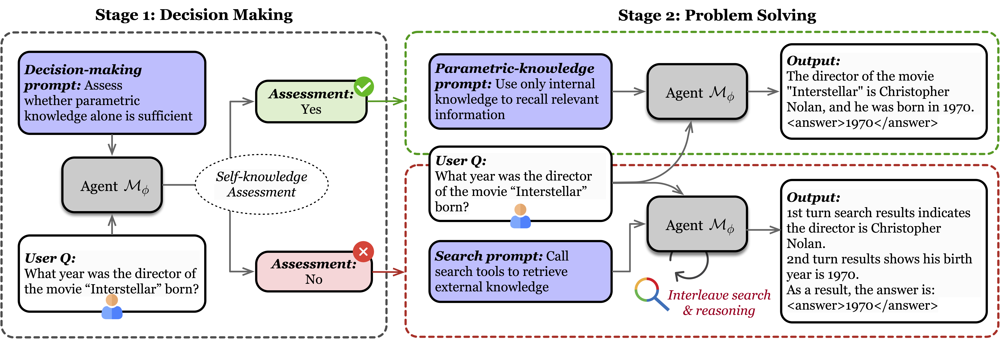
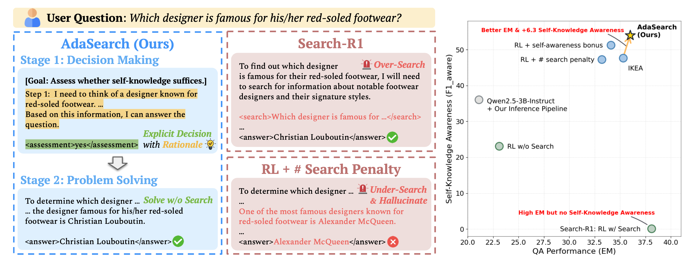

<div align="center">

# AdaSearch: Balancing Parametric Knowledge and Search in Large Language Models via Reinforcement Learning
</div>

[📄 **Paper**](https://arxiv.org/abs/2512.16883) · [🤗 **Models**](https://huggingface.co/collections/hank0316/adasearch)

**AdaSearch** is a two-stage inference and reinforcement learning framework for LLM-based search agents, which disentangles search-invocation decision-making from problem solving and optimizes them independently.

<div align="center">

</div>

Compared to prior work, AdaSearch selectively invokes search, provides transparent decision rationales for user auditing, and achieves stronger self-knowledge awareness, while preserving QA performance.

<div align="center">

</div>

If you find our code, data, models, or the paper useful, please cite the paper:
```bibtex
@misc{lin2025adasearchbalancingparametricknowledge,
      title={AdaSearch: Balancing Parametric Knowledge and Search in Large Language Models via Reinforcement Learning}, 
      author={Tzu-Han Lin and Wei-Lin Chen and Chen-An Li and Hung-yi Lee and Yun-Nung Chen and Yu Meng},
      year={2025},
      eprint={2512.16883},
      archivePrefix={arXiv},
      primaryClass={cs.CL},
      url={https://arxiv.org/abs/2512.16883}, 
}
```

---

## News
* 2025/12/20: add README.md, models, and artifacts.

---

